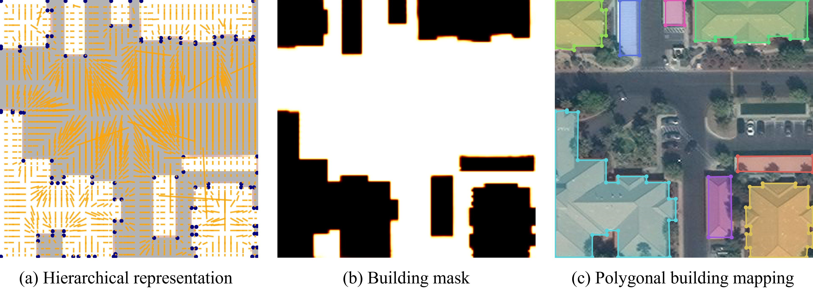

# Accurate Polygonal Mapping of Buildings in Satellite Imagery [[arXiv]](https://arxiv.org/abs/2208.00609)
### Bowen Xu*, Jiakun Xu*, Nan Xue† and Gui-Song Xia† 
#### (* indicates equal contributions, and † indicates the corresponding authors)
---

## Highlights
- We address the **mask reversibility** issue of polygonal mapping of buildings 
by proposing the **HiSup**, which takes the hierarchical supervision signals 
of vertices, boundaries and masks to guide the convolutional neural network to learn in a shape-aware fashion.
- We present a key component of aggregating the embedding of attraction fields into the learning of high-level masks and the bottom-level vertices.
- We set several new state-of-the-art performances on the challenging AICrowd benchmark in terms of AP and Boundary AP
by learning semantically-accurate and geometrically-precise masks.
## Installation
Ubuntu-18.04, CUDA 11.0, pytorch1.7/1.8, GCC 7.3
```
conda create -n hisup python=3.7
conda activate hisup
conda install pytorch==1.7.0 torchvision==0.8.0 cudatoolkit=11.0 -c pytorch

cd HiSup
conda develop .
pip install -r requirements.txt

cd hisup/csrc/lib
make
```
For evaluation with boundary IoU, please install boundary IoU API following [the installation instruction](https://github.com/bowenc0221/boundary-iou-api).

## Quickstart with the pretrained model
You can run the following command to get quickstart.
```
python scripts/demo.py --dataset crowdai --img [YOUR_IMAGE_PATH]
```
`--dataset crowdai` means load the model pretrained on AICrowd dataset, if you want to load the model pretrained on Inria dataset, simply change `crowdai` into `inria`.

You can also run our demo using Colab: [](https://colab.research.google.com/drive/162nuZq9ghB4pQQ9qsC9eZZK5Wn2qtUEW?usp=sharing) 

## Training & Testing
### Data prepare
- Download the train.tar.gz and val.tar.gz from [AICrowd dataset](https://www.aicrowd.com/challenges/mapping-challenge-old)
- Download the [Inria dataset](https://project.inria.fr/aerialimagelabeling/) and put data in the inria/raw files
- Run the inria_to_coco.py from the tools file to get training data in COCO format for Inria dataset. After the generation,
the training data should be in inria/train file.

The structure of the data file should be like: 
```
/data # AICrowd dataset downloaded from website
|-- crowdai
    |-- train
    |   |-- images
    |   |-- annotation.json
    |   |-- annotation-small.json
    |-- val
    |   |-- images
    |   |-- annotation.json
    |   |-- annotation-small.json
|-- inria
    |-- raw
        |-- train
        |   |-- images
        |   |-- gt
        |-- test
        |   |-- images
    |-- train
        |   |-- images
        |   |-- annotation.json
```
### Training
The model with HRNetV2 as backbone are initialized with imagenet pretrained parameters. You could 
download them from https://github.com/HRNet/HRNet-Image-Classification and put them in the path of 
./hisup/backbones/hrnet_imagenet.

Single GPU training
```
python scripts/train.py --config-file config-files/crowdai-small_hrnet48.yaml 
```
Multiple GPUs training
```
CUDA_VISIBLE_DEVICES=0,1,2,3 python -m torch.distributed.launch --nproc_per_node=4 scripts/multi_train.py --config-file config-files/crowdai_hrnet48.yaml
``` 

### Testing 
After training, a file defined by the "OUTPUT_DIR" in the config file will appear in the catalog, which contains the trained parameters.
For the "crowdai-small_hrnet48.yaml", the trained parameters are like:
```
/outputs/crowdai_hrnet48
-- config.yml        # saved hyper-parameters setting
-- log.txt           # saved experimental log
-- train.log         # saved training log
-- model_00030.pth   # parameters
-- last_checkpoint   # directory of the parameters' file
```
We also provide the pretrained models with HRNetV2-W48 as backbone on AICrowd dataset and Inria dataset. 
You can download the [pretrained models](https://drive.google.com/drive/folders/1IYAuM08Cmqp6OzHKWFv0y-gplNe2E8t2),
and put them in the right directory according to configuration files.
```
python scripts/test.py --config-file config-files/crowdai_hrnet48.yaml
```
### Evaluation
We provide implementation of different metrics for evaluation. 
You can run the following command to evaluate the test results in MS-COCO format.
The [prediction](https://drive.google.com/drive/folders/1VgOqnWfCJxic1riOtq7tT96-8w58ss7g) in json format corresponding to the validation set of AICrowd dataset is provided.
```
python tools/evaluation.py --gt-file [GT_ANNOTATION_FILE] --dt-file [PREDICT_ANNOTATION_FILE] --eval-type boundary_iou
```

## Acknowledgement
This repo benefits from [hawp](https://github.com/cherubicXN/hawp), 
[ECA-Net](https://github.com/BangguWu/ECANet),
[HR-Net](https://github.com/HRNet/HRNet-Image-Classification),
[boundary iou api](https://github.com/bowenc0221/boundary-iou-api),
[frame-field](https://github.com/Lydorn/Polygonization-by-Frame-Field-Learning),
[polymapper](https://github.com/lizuoyue/ETH-Thesis),
[polyworld](https://github.com/zorzi-s/PolyWorldPretrainedNetwork). We thank the authors for their great work.
